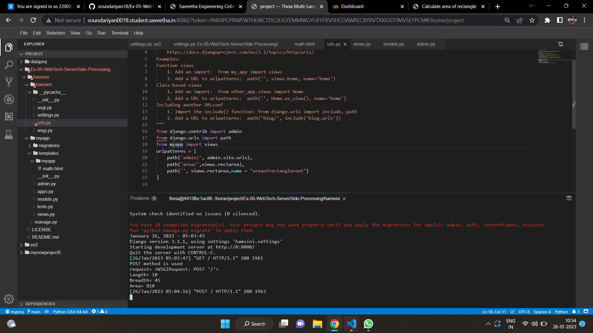
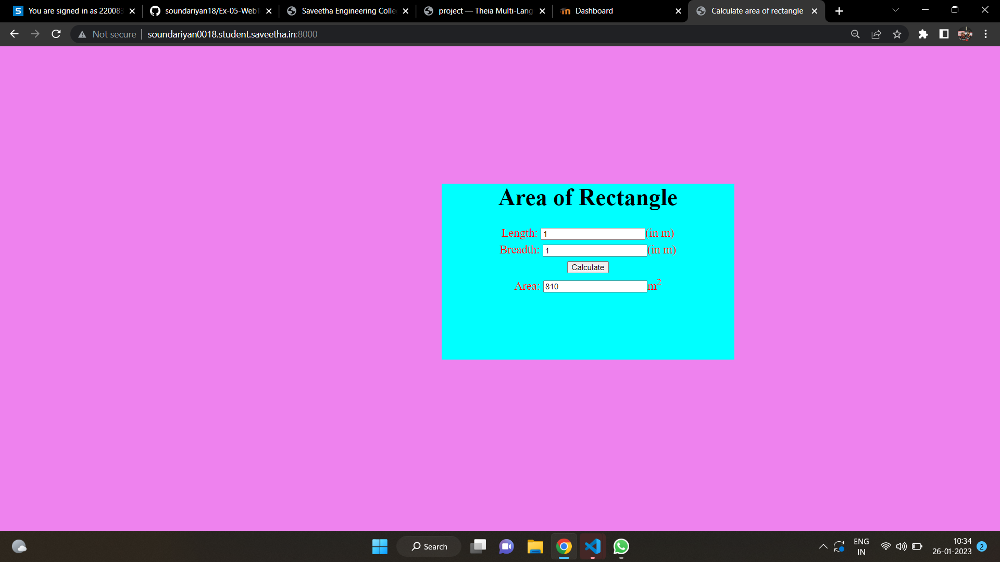

# Design a Website for Server Side Processing

# AIM:

To design a website to perform mathematical calculations in server side.

# DESIGN STEPS:

## Step 1:
clone the repository from github


## Step 2:
create django project.


## Step 3:
create a new app


## Step 4:
create python programs for views and urls.


## Step 5:
create a HTML file of forms.

## Step 6:
create the website in the given URL.

# PROGRAM:
```html
<!DOCTYPE html>
<html>
    <head>
        
        <Title>Calculate area of rectangle</Title>
        <meta name="viewport" content="width=device-width, initial-scale=1.0">
        <style>
        body{background-color:  violet;
        }
        .edge{
            width:1080px;
            margin-left:auto;
            margin-right: auto;
            padding-top: 200px;
            padding-left: 300px;
        }
        .box{
            display: block;
            border: darkslateblue;
            width:500px;
            min-height: 300px;
            font-size: 20px;
            background-color:cyan;
            text-align:center;
            margin-left:auto;
            margin-right: auto;
        }
        .formelt{
            color:red;
            text-align: center;
            margin-top: 5px;
            margin-bottom: 5px;
        }
        .h1{
            color:red;
            text-align: center;
            padding-top: 20px;
        }

        </style>

    </head>
    <body>
        <div class="edge">
            <div class="box">
                <h1>Area of Rectangle</h1>
                <form method="POST">
                
                <div class="formelt">
                    Length: <input type="text" name="length" value="{{1}}"></input>(in m)<br/>
                </div>
                <div class="formelt">
                    Breadth: <input type="text" name="breadth" value="{{1}}"></input>(in m)<br/>
                </div>
                <div class="formelt">
                    <input type="submit" value="Calculate"></input><br/>
                </div>
                <div class="formelt">
                    Area: <input type="text" name="area" value="{{area}}"></input>m<sup>2</sup><br/>
                </div>
                </form>
            </div>

        </div>

    </body>
</html>
```
views.py
```python
def rectarea(request):
    context={}
    context['area'] = "0"
    context['l'] = "0"
    context['b'] = "0"
    if request.method == 'POST':
        print("POST method is used")
        l = request.POST.get('length','0')
        b = request.POST.get('breadth','0')
        print('request=',request)
        print('Length=',l)
        print('Breadth=',b)
        area= int(l) * int(b)
        context['area'] = area
        context['l'] = l
        context['b'] = b
        print('Area=', area)
    return render(request,"myapp/math.html",context)
```
urls.py
```python
from django.contrib import admin
from django.urls import path
from myapp import views
urlpatterns = [
    path('admin/', admin.site.urls),
    path('area/',views.rectarea),
    path('', views.rectarea,name = "areaofrectangleroot")
]
```

# OUTPUT:


# HOMEPAGE:


# RESULT:

The program is executed succesfully
